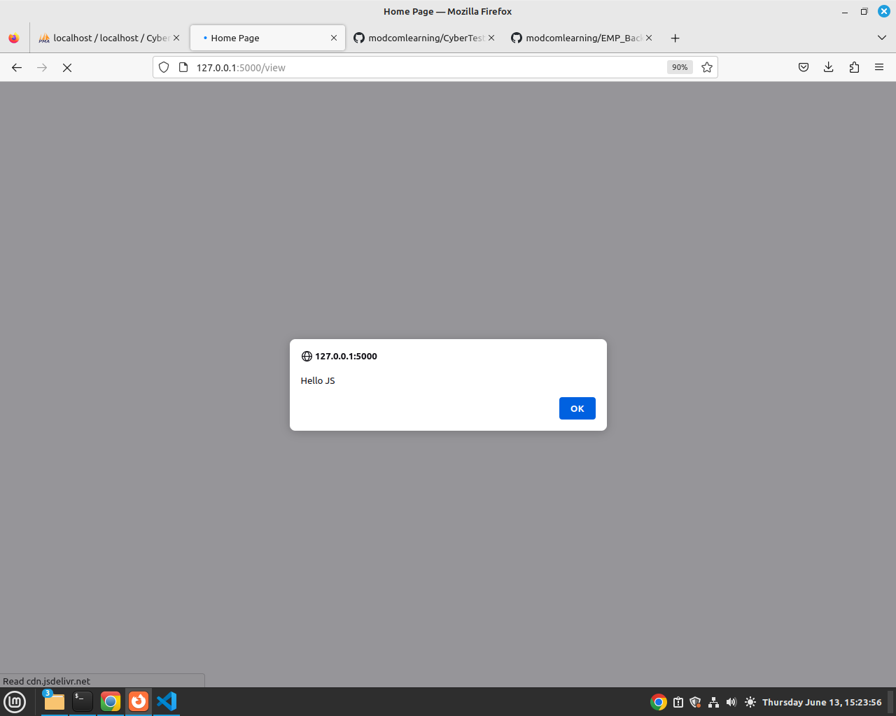

## Cybet Test System
 This is build in python flask framework, its developed to help in understanding of cyber security concepts such as Cross SIte Scripting, Broken Access Control, Session Managements

 ## Set Up

 ### Installation

    pip3 install pymysql 

 Install Xampp and import the database named CyberTestSystem.sql. 
 Open VS Code and open the Folder containing the python project.

 Run your Flask App.
 Access  http://127.0.0.1:5000/signin

 ### Part1 - Broken Access Control 
 The Application has 2 user Account: Admin and User Roles 
 Admins can only View Messages and Users can Only Add a Message.  

 Login Credentials

  

 The Application demonstrates how to SOlve Broken Access Control Issues in Cyber Security by having different users have access to specific functions in the System. 

 ### Broken Access Control Protection
 Broken Access Control is a significant security vulnerability where users can access data or functions they are not entitled to. To secure against broken access control, consider implementing the following best practices:

  
 1. Enforce Least Privilege 
Minimal Access: Ensure users have the least privilege necessary to perform their functions. Regularly review roles and permissions to adjust as needed. 
Role-Based Access Control (RBAC): Implement RBAC to manage user permissions. Assign roles based on job functions and ensure these roles have the minimum required permissions. 

2. Use Strong Access Controls 
Authentication: Use strong, multi-factor authentication (MFA) to verify user identities.
Session Management: Properly manage user sessions, ensuring they time out after a period of inactivity and regenerate session IDs upon login. 

3. Implement Access Control Mechanisms 
Centralized Access Control Logic: Implement centralized access control logic to avoid inconsistencies. Use a single point of access control for all resource checks.
Deny by Default: Deny access by default, and explicitly grant permissions where necessary.

4. Validate Permissions on Server-Side 
Server-Side Checks: Always enforce access control on the server side. Never rely on client-side controls, as they can be bypassed. 
Parameterize Access Checks: Use parameterized access checks to ensure permissions are verified against each specific resource or action. 

5. Use Secure Development Practices 
Code Reviews: Conduct regular code reviews focusing on access control issues.
Security Testing: Perform security testing, including automated scanning and manual penetration testing, to identify and fix access control weaknesses. 
Static and Dynamic Analysis: Use static code analysis tools to identify potential access control flaws and dynamic analysis tools to verify the application's behavior. 

6. Implement Logging and Monitoring 
Audit Logs: Maintain detailed logs of access control decisions and user actions. Monitor these logs for suspicious activity. 
Real-Time Monitoring: Implement real-time monitoring and alerting for access control violations.

7. Education and Awareness 
Developer Training: Educate developers about access control risks and best practices. Ensure they understand the importance of secure coding practices.
User Awareness: Inform users about the importance of secure practices, such as not sharing credentials and recognizing phishing attempts. 

8. Review and Update Access Controls Regularly 
Regular Audits: Regularly audit access controls and update them as necessary. Ensure that permissions are still appropriate for current user roles. 
Automated Tools: Use automated tools to help manage and review access control configurations.

10. Use Frameworks and Libraries 
Security Frameworks: Leverage security frameworks and libraries that provide built-in access control mechanisms, such as Spring Security for Java or ASP.NET Identity for .NET applications.

 ### Part2 - Stored XSS
 Stored XSS, also known as persistent XSS, is the more damaging of the two. It occurs when a malicious script is injected directly into a vulnerable web application, mostly it ca be stored in the database. This Script will execute when a user visits a Page that fetches the data containing the injected script. Reflected XSS on the other hand involves the reflecting of a malicious script off of a web application, onto a user's browser.

 This application also demonstrates stored XSS scenario and their Protection.

 To test stored XSS in this application, Login to the application as a user, Navigate to Add Messages, Type the Message Title as "Request for Permission". In the Message Body Type a message which includes a Javascript code.. We will assume below code could be malicious.  

       I was requesting for an off.
        
       Thank you.

Please confirm in the messages table in your database that the Above script has been saved as it is(Code).
This is what is called injected Script, The Attacker pretends to be posting a Message but instead the message is accompanied by some malicious code.
 
Now, logout and login as admin, assuming the admin want to read the posted messages.
Once logged in as admin, click view messages.
 
What happens? 
The Javascript injected or stored in one of the messages, executes!
 

 
This means the attacker manages to execute their codes in your own application!
 
It also means the attacker can inject/plant a malicious code that could either;  
1. Steal User cookies and sessions  
2. Encrypt/Delete some data 
3. Any other malicious code. 

Here is an example of Javascript Cookie stealer that can be injected and stored, Once it executes it could steal user session data in the browser 

Below code we steal victim's data stored in browser, i.e sessions and send to the attacker through https://coding.co.ke/ss/ domain.  

Try Inject below code as a message in our App 

      

 ### XSS Protection
 To protect against stored XSS, follow these best practices:

1. Input Validation and Sanitization 
Whitelist Input Validation: Only allow expected inputs. For example, if a field is expected to contain only numbers, ensure that it contains only numbers.
Sanitize Input: Remove or escape special characters that could be used to inject malicious scripts. Use libraries or built-in functions to sanitize input. For example, in PHP, use htmlspecialchars() to convert special characters to HTML entities.
 

2. Output Encoding 
HTML Encoding: Encode all user-generated content before outputting it in HTML. This prevents the browser from interpreting it as executable code. For example, in JavaScript, you can use textContent instead of innerHTML.
Attribute Encoding: Properly encode data being placed in HTML attributes. Use functions like htmlspecialchars() or htmlescape() in your server-side language.
JavaScript Encoding: When inserting user data into JavaScript, ensure it's properly encoded to avoid script injection.

 

3. Content Security Policy (CSP) 
Implement a Content Security Policy to restrict the sources from which your web application can load resources. This can help mitigate the impact of XSS by blocking the execution of malicious scripts.

       
      Content-Security-Policy: script-src 'self';
       

4. HTTPOnly and Secure Cookies 
HTTPOnly Cookies: Set the HttpOnly flag on cookies to prevent access to them via JavaScript.
Secure Cookies: Use the Secure flag to ensure cookies are only sent over HTTPS.

 

5. Web Application Firewalls (WAFs) 
Deploy a web application firewall that can detect and block malicious requests based on patterns.

 

6. Regular Security Audits and Penetration Testing 
Conduct regular security audits and penetration testing to identify and fix vulnerabilities before they can be exploited.

 

7. Frameworks and Libraries 
Use modern web frameworks that automatically handle many common security concerns, including XSS protection. For example, frameworks like React and Angular escape data by default.

 

8. Proper Session Management 
Implement proper session management practices to minimize the risk of session hijacking due to XSS. This includes setting appropriate session timeouts and regenerating session IDs on login.

 

9. Educate Developers 
Ensure that developers are educated about security best practices and understand the common vectors for XSS attacks and how to prevent them.

### Input Sanitization.
Open your app.py and improve the /add route. by sanitizing user input in two variables namely message_title and message_body.

In Terminal install.  

         pip3 install bleach

Then update your /add route to look like below  

      # IMPORT BLEACH BELOW
      import bleach
      @app.route("/add", methods = ['POST', 'GET'])
      def add():
         # Is anyone logged in?
         if 'userrole' in session:
            # We retrieve the user who is logged in and the role
            role = session['userrole']
            # If its user, we access Add Page
            if role == "user":
                  if request.method =='POST':
                     # UPDATE BELOW CODES, WE SANITIZE THE INPUTS
                     message_title = bleach.clean(request.form['message_title'])
                     message_body = bleach.clean(request.form['message_body'])

         
                     # we now save our message_title, message_body to database
                     connection = pymysql.connect(host='localhost', user='root', password='',
                                                database='CyberTestSystem')

                     cursor = connection.cursor()
                     # create an insert query to insert data to shop_users
                     cursor.execute('insert into messages(message_title,message_body)values(%s,%s)',
                                 (message_title, message_body))
                     connection.commit() # write the record to the table
                     return render_template('add.html', success='Thank you for Registering.')
                  else:
                     return render_template('add.html') 
            else:
                  return render_template("signin.html", message  = "Access Denied, Login in as a User.")
         else:
            return redirect('/signin')

Delete the injected codes from the database, Login as a user, Post below message containing JS code, Post to database.

         I was requesting for an off.
          
         Thank you.

Confirm in your database, messages table. Notice that the JS code is Sanitized,Its not saved as Code.
i.e the < > signs have been replaced by &lt  and  &gt respectively, This removes JS capabilities.   

Similary, Login as admin and view messages, Notice the Messages are well Viewed as they way it was Posted.

### Part 3- Logging and Monitoring 
Logging is a method of tracking and storing data to ensure application availability and to assess the impact of state transformations on performance. Monitoring is a diagnostic tool used for alerting system-related issues by analyzing metrics. 

Add this code below. Place after app.secret_key = '1_@Ma8vU!_qRb_*A'

We use Flask Logger,   Flask's app.logger uses Python's built-in logging module, which does not include a success logging level by default. The default logging levels are: DEBUG, INFO, WARNING, ERROR, and CRITICAL.

      # Configure logging
      import logging
      from logging.handlers import RotatingFileHandler
      handler = RotatingFileHandler('error.log', maxBytes=10000, backupCount=1)
      handler.setLevel(logging.DEBUG)
      formatter = logging.Formatter(
         '%(asctime)s %(levelname)s: %(message)s [in %(pathname)s:%(lineno)d]')
      handler.setFormatter(formatter)
      app.logger.addHandler(handler)
      app.logger.setLevel(logging.DEBUG) 

Then In /signin route we can log an error after a failed Login
See below an updated /signin , Observe these lines  and place them in your login.

      app.logger.error(f'Failed login attempt for email: {email}')
      app.logger.info(f'Success login for email: {email}')

Updated /signin route  

      @app.route('/signin',  methods= ['POST','GET'])
      def signin():
         if request.method =='POST':
            email = request.form['email']
            password = request.form['password']

            connection = pymysql.connect(host='localhost', user='root', password='',
                                          database='CyberTestSystem')

            cursor = connection.cursor()

            cursor.execute('select * from users where email = %s and password = %s',
                           (email, password))
            # check if above query found a match or not
            if cursor.rowcount == 0:
                  app.logger.error(f'Failed login attempt for email: {email}')
                  return render_template('signin.html', error = 'Wrong Credentials')

            else:
                  app.logger.info(f'Success login for email: {email}')
                  user = cursor.fetchone()
                  # Retrieve the user Role
                  role = user[3] # role is at position 3 in our table
                  # Store the Role and Email in session
                  session['userrole'] = role
                  
                  return redirect('/')

         else:
            return render_template('signin.html')

Read more  
https://www.appdynamics.com/product/how-it-works/application-analytics/log-analytics/monitoring-vs-logging-best-practices#~best-practices-for-integrating-logging-and-monitoring

END 