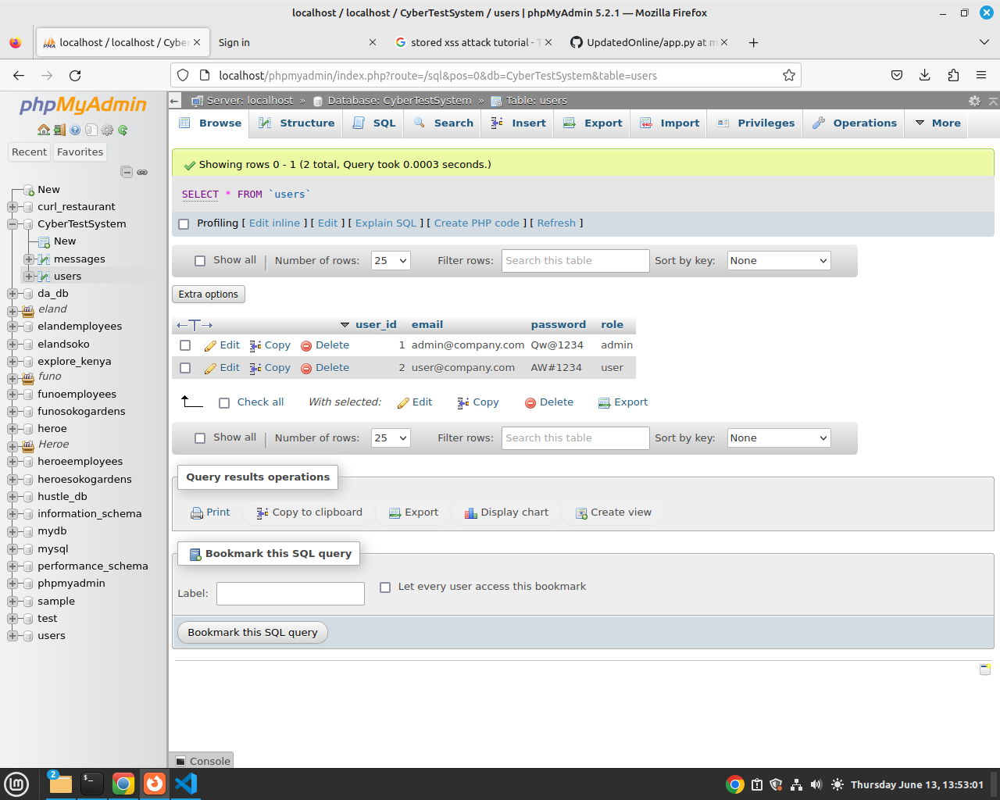

## Cybet Test System
 This is build in python flask framework, its developed to help in understanding of cyber security concepts such as Cross SIte Scripting, Broken Access Control, Session Managements

 ## Set Up

 ### Installations

    pip3 install pymysql 

 Install Xampp and import the database named CyberTestSystem.sql. 
 Open VS Code and open the Folder containing the python project.

 Run your Flask App.
 Access  http://127.0.0.1:5000/signin

 The Application has 2 user Account: Admin and User  
 Admins can only View Messages and Users can Only Add a Message.  

 Login Credentials

 

 The Applications demonstrates how to SOlve Broken Access Control Issues in Cyber Security by having different users have access to specific functions in the System. 